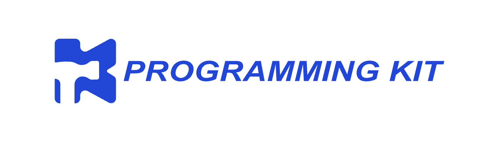

# Programming Kit

<div align=center>

</div>


Instructions for using common programming tools.

## Deployment

```
$ FORK https://github.com/kanyan9/programming-kit/tree/main to YOUR REPO
$ git clone YOUR REPO<e.g. https://github.com/YOUR/programming-kit.git>
$ cd programming-kit
$ make html # After that, the generated doc can be found in programming-kit/build/html
$ # modify the doc
$ git push # or pull request
```

## Contribution
Contributions are most welcome! If you have edits or new content to add, please open an issue.

The commit specification for this project uses [AngularJS Git Commit Message Conventions](https://docs.google.com/document/d/1QrDFcIiPjSLDn3EL15IJygNPiHORgU1_OOAqWjiDU5Y/edit?pli=1#heading=h.uyo6cb12dt6w). 

## Acknowledgement
This project was inspired by the [MIT missing-semester course](https://github.com/missing-semester/missing-semester), and refer to its excellent content. More details can be learned in the course, for which I would like to express my gratitude to the authors.
