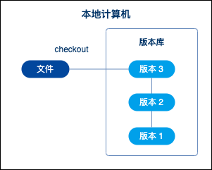
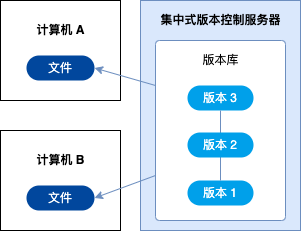
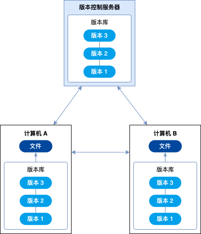
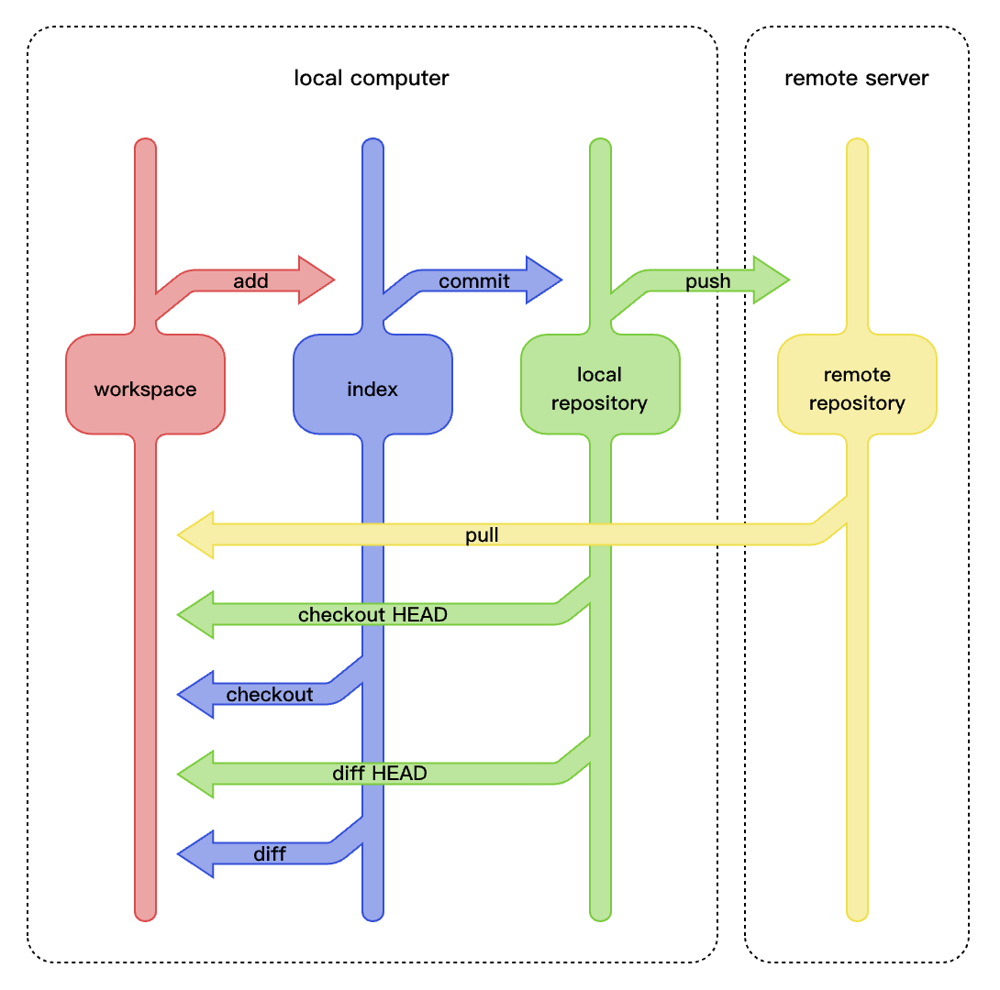
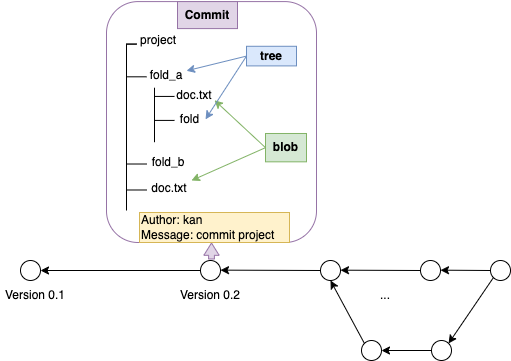
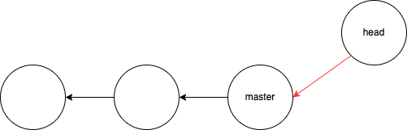
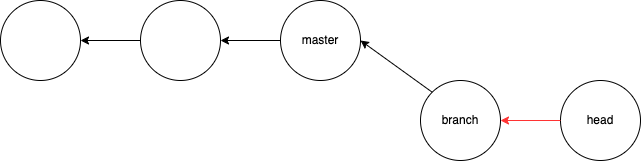
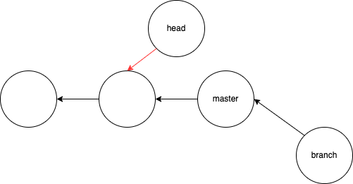

=========
版本控制
=========

什么是版本控制
==============
版本控制就是记录项目中文件变化的过程，可查看某个特定时间点文件的修订情况，或者查阅某个特定文件版
本的修订情况。有了版本控制，我们就可以比较文件的变化，定位出现的错误，甚至在项目所有文件被删除后仍
然可以用很小的代价恢复到原先的样子。

版本控制发展
==============
最原始的版本控制就是复制项目副本并标记时间戳，每次有修改时就重复上面的步骤，这个方法非常的简单且
容易操作，但是在手动操作时很容易犯错，一不小心就会忘记备份或复制副本导致修改前内容丢失。为了解决
这个问题，诞生了本地版本控制系统，最常用的本地版本控制系统就是保存记录文件修订前后变化内容的补丁，
形成补丁集。通过相应的补丁就可以计算出某个版本文件内容，如图所示。

集中式版本控制系统
------------------
本地版本控制系统解决了部分版本控制的问题，但是实际过程中又出现了新的问题，如何让不同系统的开发者
协作开发。为了解决开发者协作的问题，诞生了集中式版本控制系统（Centralized Version Control 
Systems）。集中式版本控制系统的特点是有一个单一的集中管理的版本服务器，保存所有文件的修订版本并
对所有协作者可见，协作的开发者通过访问这台版本服务器获取最新的文件，或者提交最新修改的文件，如图
所示。

集中式版本管理解决了多个开发者协作的问题，但是单一的集中管理的版本服务器存在很高的单点故障风险，
如果出现故障，谁都无法提交更新，也就无法协同工作。如果中心数据库所在的磁盘发生损坏，又没有做恰当
备份，将丢失所有数据——包括项目的整个变更历史，只剩下协作者在各自机器上保留的单独快照。本地版本控
制系统也存在类似问题，只要整个项目的历史记录被保存在单一位置，就有丢失所有历史更新记录的风险。

分布式版本控制系统
------------------
为了解决单点故障问题，分布式版本控制系统（Distributed Version Control System）应运而生。在
分布式版本控制系统中，连接版本控制服务器的客户端并不只获取最新的版本的快照，而是把整个版本库完整
地镜像下来，包括文件及完整的历史记录。这样，如果任何一处协同工作用的服务器发生故障，事后都可以用
任何一个镜像出来的本地仓库恢复。 因为每一次的克隆操作，实际上都是一次对代码仓库的完整备份，如图所
示。

Git
=====
Git就是一个典型的分布式版本控制系统，用来 **追踪项目的变化**。

Git安装
---------
在linux上可以通过linux发行版自带的包管理工具安装git，如果你使用的是Fedora，你可以使用dnf：

.. code-block:: bash

  $ sudo dnf install git

如果你使用的是基于Debian的发行版，如Ubuntu，你可以使用apt：

.. code-block:: bash

  $ sudo apt install git

Git使用前最小准备
-----------------
安装完成Git之后，还要完成一些配置才可以更好的使用Git，其中最公用的是配置Git使用者的用户名和邮箱
信息，我们也把配置用户名和邮箱信息成为使用Git前的最小准备，配置用户名和邮箱信息主要通过以下命令：

.. code-block:: bash

  $ git config [--local|--global|--system] user.name "name"
  $ git config [--local|--global|--system] user.email "email"

在设置时会用到--local、--global和--system参数来规定设置的有效范围，--local表示对本仓库有效，
--global参数表示对当前用户的所有仓库有效，--system表示对本系统的所有用户有效。一般情况下选择
--global参数完成用户名和邮箱信息设置。

创建一个Git项目
----------------
当项目不存在时可以通过如下方式快速创建一个Git项目

.. code-block:: bash

  $ git init my_project

对已有的项目进行Git版本管理，可通过如下方式

.. code-block:: bash
  
  $ cd my_project
  $ git init

Git架构及基本工作流程
----------------------
Git架构的几个核心组件包括：本地工作区（Working Directory）、暂存区（Staging Area）、版本库
（Repository）和远程仓库（Remote Repository），如图所示，下面详细介绍Git核心组件。

1.本地工作区（Working Directory）

这是在本地机器上存储代码文件的地方，也是开发人员直接编辑和修改代码的地方。

2.暂存区（Staging Area）

在本地工作区中修改代码后，可以使用git add命令将这些修改添加到暂存区，准备提交到版本库。

3.版本库（Repository）

版本库包含着完整的项目历史记录，可以使用git commit命令将暂存区的内容提交到本地版本库中，每次提
交到暂存区的改动都会被永久存储在版本库中。

4.远程仓库（Remote Repository）

远程仓库是位于远程服务器上的版本库副本，可以使用git push命令将本地版本库推送到远程仓库中，用于
团队成员之间的代码共享和协作。

Git数据模型及实现
-----------------
为了更深入理解Git内部的工作机制和运行方式，并且理解Git设计的精妙。本小节将介绍Git数据模型和关键概念。

Git数据模型
************
使用Git做版本管理的本质是保存项目及其所包含的所有文件和文件夹，追踪并记录其变化。为此Git对项目、
文件夹和文件都做了抽象，将其抽象为commit、tree和blob等数据模型,如图所示。

提交对象（commit）
~~~~~~~~~~~~~~~~~~~~
commit对应Git管理的整个项目文件目录，可以理解为某一时刻该项目的一个快照（snapshots），包含了
构成项目的所有的文件夹和文件。

树对象（tree）
~~~~~~~~~~~~~~~~~~~
tree对应项目文件目录中某个具体的文件夹，Git通过tree来表示一个文件夹。

数据对象（blob）
~~~~~~~~~~~~~~~~~~~
blob对应项目文件目录或文件目录下某个文件夹里的一个文件，内容是一堆字符，Git在进行版本管理时并不
关心文件名，只关心blob，如果两个名称不同的文件，其内容相同及blob相同，Git将认为他们是一个文件，
节省了存储空间。

版本追踪模型（Modeling history）
~~~~~~~~~~~~~~~~~~~~~~~~~~~~~~~~~~~
最简单的版本追踪模型是线性模型，一个版本只有一个父版本，版本依次迭代。在Git中使用有向无环图模型
追踪版本历史，一个版本一定会参考一个父版本或多个父版本，多个父版本合并自己所有的特性后形成了一个
子版本，这样的版本追踪模型允许Git可以多分支并行开发。

对象（objects）和内容寻址（content-addressing）
*************************************************
commit、tree和blob在Git中被统称为Git的对象（objects）。Git是高效的版本管理系统，为了优化对
象的访问效率，Git将对象的管理抽象为一个内容寻址文件系统，其核心是一个简单的键值对数据库（key-value
data store）。Git中每个对象都有一个唯一的键（SHA-1哈希值）与之对应，对象的访问可类比内存的寻
址访问操作，通过哈希值访问对象内容而不是直接访问对象内容。

.. code-block:: text

  # 数据对象合集
  objects[]

  # 储存一个数据对象
  store(obj)
    id = SHA-1(obj)
    objects[id] = obj

  # 访问一个数据对象内容
  load(id)
    return objects[id]

Git中对象都是不可变的，表示对象的键的哈希值通常由40个字符组成，实际使用需要注意当Git中哈希值已
经可以作为唯一标识了，实际使用时显示的哈希值就比较短，否则哈希值会全部显示。

Ref（引用）
*************
哈希值作为键来索引commit时，对人类来说毫无意义，因为人类不能理解一串无序的字符。为了让人类更好的
理解哈希值对应的内容，Git抽象出 **引用（Ref）** 来对应commit的哈希值,引用和哈希值一一对应。
引用和对象不同，引用是可变的，也是人类可以理解的字符串。

.git目录
*************
Git在所管理的项目目录下的.git目录中实现了其抽象出来的数据对象和引用，并实现对项目版本变化历史进
行追踪。当在一个新目录或已有目录中执行git init时，Git会创建一个.git目录。 这个目录包含了几乎所
有Git存储和操作的东西。如果想备份或复制一个版本库，只需把这个目录拷贝至另一个地方即可。 下面讨论
的所有内容，均位于这个目录内。新初始化的.git目录的典型结构如下：

.. code-block:: text

  -- .git
     ├── config
     ├── description
     ├── HEAD
     ├── hooks/
     ├── info/
     ├── objects/
     └── refs/

随着Git版本的不同，该目录下可能还会包含其他内容。不过对于一个全新的git init版本库，上面展示的目
录结构是默认的结构。其中最重要的是HEAD、config、refs和objects。

HEAD
~~~~~~~
HEAD文件是文本文件，HEAD是一个ref，指向当前的工作分支。与ref一样HEAD是可变的，可以通过git checkout
切换当前工作分支来改变HEAD；

HEAD在工作时有三种典型状态：指向master分支，指向其他分支和分离头指针。

指向master表示此时工作分支为master分支，如图所示。

指向其他分支表示此时除master分支外还有其他分支，此时工作在其他分支上，如图所示。

Git中有一种现象叫分离头指针（detached HEAD），一般情况下当我们工作在某个分支上时，例如工作
在master分支，master指针和HEAD指针是一起前进的，每做一次提交，两个指针就一起向前移动，但当HEAD
指向了某个具体的commit，master指针和HEAD指针的绑定状态被打破时，就会出现分离头指针，如图所示。

config
~~~~~~~~
config文件中记录了当前仓库相关的git配置信息；通过对这几个目录的详细解读，我们将了解Git的运行方式。

refs
~~~~~~~
refs目录存储指向分支、标签等对应的commit的指针，其中refs/heads存放指向不同分支对应的commit的
指针，refs/tags存放指向标签对应（或叫项目里程碑）的commit的指针；

objects
~~~~~~~~~
objects目录存放所有数据内容包括commit、tree和blob是objects数据模型的实现。objects文件夹中
的子文件出info、pack以外都是以commit的哈希值的前两位命名，后38位做其中的文件名。

Git常用命令
------------
使用Git进行版本管理时，最常用的方法是用命令行进行管理，下面介绍一些常用的Git命令，其中<>中的内
容都可以根据使用者的实际使用情况进行替换。

本地Git常用命令
******************
查看版本演变的的历史

.. code-block:: bash

  $ git log
  $ git log --oneline     # 以单行的方式列举版本演变历史
  $ git log -n4           # 查看分支最近的4条版本演变历史
  $ git log --all         # 查看所有分支的版本演变历史
  $ git log --graph       # 以图形化的方式查看版本演变历史

查看本地分支情况

.. code-block:: bash

  $ git branch -v

创建新的分支

.. code-block:: bash

  $ git branch <new_branch> <original_branch>
  $ git checkout <new_branch>

或

.. code-block:: bash

  $ git checkout -b <new_branch> <original_branch>

合并分支到主分支

.. code-block:: bash

  $ git checkout <main>       # 切换到主分支
  $ git merge <new_branch>    # 合并分支到主分支

删除分支

.. code-block:: bash

  $ git branch -d <new_branch>    # 删除一个分支
  $ git branch -D <new_branch>    # 强力删除一个分支

修改文件名

.. code-block:: bash

  $ git mv <old_name> <new_name>

删除文件

.. code-block:: bash

  $ git rm <file_name>

对比不同commit间的差异

.. code-block:: bash

  $ git diff <commit_sha_1> <commit_sha_2> -- <file_name>

对比暂存区和HEAD所含文件的差异

.. code-block:: bash

  $ git diff --cached

对比工作区和暂存区所含文件的差异

.. code-block:: bash

  $ git diff                 # 比较工作区和暂存区中所有文件的差别
  $ git diff -- <file_name>    # 比较工作区和暂存区中某个具体文件的差别

临时保存工作区的内容并在需要时恢复

.. code-block:: bash

  $ git stash          # 临时保存
  $ git stash apply    # 恢复临时保存，但不删除保存内容
  $ git stash pop      # 恢复临时保存，并删除保存内容

查看git存储库中文件的格式（注：该命令被称为剖析Git底层原理的瑞士军刀）

.. code-block:: bash

  $ git cat-file -t <file_name>     # 查看文件类型
  $ git cat-file -p <file_name>     # 查看文件内容
  $ git cat-file -s <file_name>     # 查看文件大小

放弃暂存区的修改，恢复成HEAD版本

.. code-block:: bash

  $ git reset HEAD                          # 恢复所有内容
  $ git reset -- <file_name> <file_name>    # 恢复多个文件的内容

放弃工作区的修改，恢复成暂存区版本

.. code-block:: bash

  $ git checkout -- <file_name>     # 恢复某个文件的内容

消除最近几次commit，让暂存区和工作区都与某个commit版本保持一致

.. code-block:: bash

  $ git reset --hard <commit_sha>

对最近一次提交的commit message做变更

.. code-block:: bash

  $ git commit --amend

对历史提交的commit message做变更

.. code-block:: bash

  $ git rebase -i <base_commit> # 根据Git提示修改

整合多个commit为一个commit

.. code-block:: bash

  $ git rebase -i <base_commit> # 根据Git提示修改

远端仓库交互命令
******************
通常本地项目目录之外的其他路径都可以称为远端仓库

关联远端仓库

.. code-block:: bash

  $ git remote add origin <url>

查看项目所有分支包括本地分支、远端仓库分支和已经删除的分支

.. code-block:: bash

  $ git branch -a

同步远端仓库内容

.. code-block:: bash
  
  $ git pull <remote_repo_name>

  # 相当于
  $ git fetch <remote_repo_name> <remote_branch>
  $ git checkout -b <local_branch>    # 习惯上local_branch与remote_branch相同
  $ git merge <remote_branch>

注：git fetch拉取远端仓库到本地后，可以查看远端分支情况，并在本地新建一个与远端分支名相同的分支。
git fetch没有执行合并操作，需要手动切换到本地分支下执行git merge。

克隆远端仓库

.. code-block:: bash

  $ git clone <url>

把本地仓库内容同步到远端仓库

.. code-block:: bash

  $ git push

除了以上列举的git常用命令之外，如果想查看更多的git命令用法,使用如下命令

.. code-block:: bash

  $ git help -web git_command。

参考文件及扩展阅读
======================

Pro Git：https://git-scm.com/book/en/v2

MIT missing semester：https://github.com/missing-semester/missing-semester/tree/master