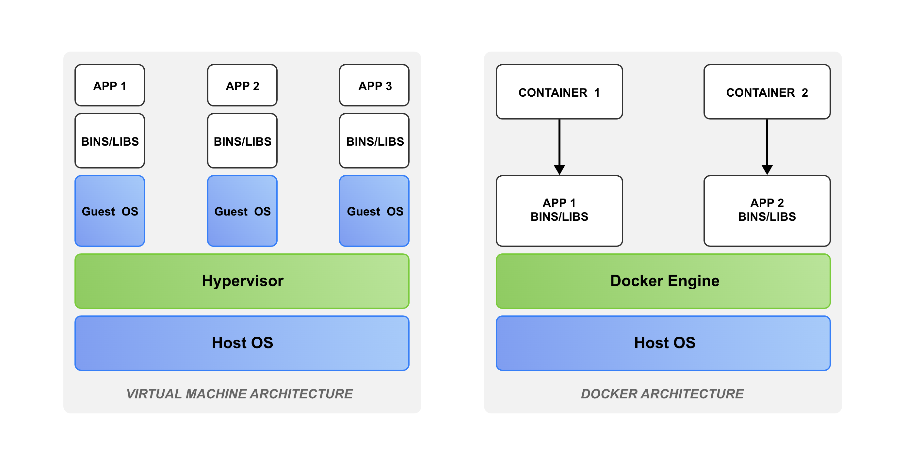

==============
虚拟机和容器
==============

虚拟机
=======

概述
-------
虚拟机通俗来讲就是模拟一个完整计算机的一套软件，每个虚拟机都有自己的操作系统和应用程序，同时模拟
出自己的整套硬件包括CPU、内存、图形加速器和存储等。一台物理计算机上通常可以运行多个虚拟机，每个虚
拟机的用户都认为自己独占了操作系统的全部资源。

使用虚拟机通常有以下优点：

- **提高资源使用率，降低硬件成本：** 一台物理计算机上可以同时运行多个虚拟机，虚拟机间相互隔离，
  不同的虚拟机可以为不同的用户服务，提高了单台设备的使用率，同时用户想使用不同操作系统时不用购买
  新的计算机，降低了用户购买设备的成本；

- **安全性和可快速恢复：**  虚拟机其实一个文件，可以通过外部程序扫描，以确定是否存在恶意软件。在
  虚拟机运行过程中可以在任意时间生成对应的快照，通过快照就可以恢复相应时间点的运行状态，保障了故
  障后快速恢复；

- **灵活性和可移植：** 虚拟机支持快速安装多种操作系统，并且可克隆已安装的虚拟机，支持开发人员和
  测试人员在不同硬件环境中快速重新部署，也支持随时创建新环境以处理新任务。

使用虚拟机通常有以下缺点：

- 在虚拟机上运行某些特殊的应用时性能会低于直接在原生硬件上运行。

工作原理
----------
虚拟机是由虚拟化技术支撑实现的，虚拟化技术允许多个虚拟环境共享一个系统。 **Hypervisor（虚拟机
监控程序）** 实现了虚拟化技术，可有效分隔物理资源并将这些资源分配给不同虚拟环境使用。

虚拟机监控程序可能位于操作系统之上，也可以直接安装在硬件上，根据虚拟机监控程序位置的不同，可分为：
Type-1和Type-2两类虚拟机监控程序。运行了虚拟机监控程序的设备称为主机，而使用其资源的虚拟机则被
称为客户机。

Type-1类
**********
这类虚拟机监控程序也称为本机或裸机虚拟机监控程序，直接在硬件上运行管理客户机。它可取代主机操作系
统，虚拟机监控程序直接将虚拟机资源调度到硬件上。这种类型的虚拟机监控程序常用于企业数据中心或其他
基于服务器的环境。

KVM、Microsoft Hyper-V和VMware vSphere都是典型的Type-1类虚拟机监控程序。KVM已于2007年合
并到Linux内核中，因此使用较新版本的Linux，可以直接使用KVM。

Type-2类
**********
这类虚拟机监控程序也称为托管虚拟机监控程序，它在传统操作系统上以应用的形式运行。其工作原理是从主
机操作系统中将客户机操作系统抽象出来。虚拟机的运行时的资源被虚拟机监控程序调度分配到主机操作系统
上，然后由主机操作系统传递给硬件执行。这种类型的虚拟机监控程序更适合希望在私人电脑上运行多个操作
系统的个人用户。

VMware Workstation和Oracle VirtualBox就是典型的Type-2类虚拟机监控程序。

使用虚拟机
----------
对个人用户而言，平时使用最多的是Type-2类虚拟机监控程序包括VirtualBox（开源）、Virt-manager
（开源，管理KVM虚拟机和LXC容器）和VMware（商用，可通过搜索序列号使用）。

使用虚拟机监控程序创建虚拟机时要分配的硬件资源如CPU核数、内存大小（不要超过提示的最大值）、磁盘
空间和网络模式（一般使用NAT模式，其他还有桥接等）进行配置以满足使用需求。为了方便虚拟机使用还可
以安装扩展功能插件如vmware-tools等。读者可根据自己选择的虚拟机监控程序在浏览器搜索对应的安装教
程创建虚拟机。

容器
======

容器是相较于虚拟机的一种更为轻量的虚拟化技术，在深入了解容器前先看看容器与虚拟机的对比，如图所示：

每个虚拟机都有一个客户机操作系统，而容器运行在只有一个操作系统的物理服务器上，不同的容器共享操作
系统和硬件资源。

容器技术
----------
容器技术最早出现的时候是为了隔离计算机中的各类资源，以降低软件开发、测试阶段可能产生的误操作风险。
容器可以看作是操作系统为每一个应用单独创建的一个称为“沙盒”的隔离环境，“沙盒”可以类比常见的集装箱，
在“沙盒”中启动应用，相当于将应用“装”进了集装箱里，集装箱让应用与应用之间有了边界，以至于在运行时
不会因为环境不同相互干扰。集装箱是可以运输的，可以搬到不同的地方而不影响其内部的环境，也就实现了
应用的迁移，这是容器技术的核心。

容器本质上是操作系统中的一个进程，依赖于操作系统提供的资源隔离与资源限制也就是依赖操作系统namespace
和cgroups机制，修改和约束了进程的动态表现，以实现运行隔离环境，这里主要探讨namespace和cgroups。

Namespaces
************
熟悉C/C++编程的开发者都了解namespaces（命名空间）的概念，Namespace主要是高级编程语言为了避免命名
冲突而提供的一种机制，例如，同一所学校有两个名为小明的学生，通过名字并不能直接区分是哪个小明，这时
就可以使用命名空间，比如A班的小明和B班的小明，避免了因为重名而出现错误。

操作系统（主要以linux为主）提供的namespaces是由内核直接提供的全局资源封装，它是内核针对进程设计的
访问隔离机制。

内核是如何实现这些的呢？

在Linux操作系统上启动一个进程时，系统都会给进程分配一个编号来标识这个进程，这个编号也被称为进程编号
（PID）。对系统的第一个进程而言，它的pid为1也被称为根进程，其余的进程都是由它派生出来的，都是它的子
进程，所有的进程组成了1个进程空间。在这个进程空间里已经启动了10个进程，当用户再启动一个进程时，这时
新的进程pid就为11。对第11号进程而言，它可以看到前10个进程的存在，追溯它的祖先进程最终可追溯到1号根
进程。如果我们可以修改第11个进程的行为，让它的PID也从1开始，从它派生出来的进程，追溯它的祖先进程只能
追溯到这个进程，而看不到系统内运行的其他编号1~10的进程，这时第11号进程就新建了一个进程空间，这样就实
现了进程的隔离。

总结一下，如果在应用进程启动时对进程空间进行修改，使得应用进程空间的子进程看到应用进程且PID为1，应用
根进程在实际系统里可能是第11号进程，这种机制就是Linux内核提供的namespaces机制，新创建的进程空间就为
一个namespaces。

在Linux系统中创建进程的系统调用是 ``clone()``，比如：

.. code-block:: c

  int pid = clone(main_function, stack_size, SIGCHLD, NULL);

在 ``clone()`` 系统调用创建一个新进程时，如果在参数中指定CLONE_NEWPID参数，比如：

.. code-block:: c

  int pid = clone(main_function, stack_size, CLONE_NEWPID | SIGCHLD, NULL);

这时新创建的这个进程pid就会从1号开始，建立一个全新的进程空间。在真实的进程空间里它的pid值还是真实的
数值。当然也可以多次执行上面的 ``clone()`` 调用就会创建多个namespaces。

Namespace技术修改了应用进程的“视图”，它只能看到某些特定的内容。

Cgroups
************
只使用namespaces并没有实现容器作为一个“沙盒”的全部功能，还要实现资源限制，Linux Cgroups就是linux
内核中用来为进程设置资源限制的一个重要功能。

Linux Cgroups的全程是Linux Control Group，最早由Google的工程师在2006年发起，最早出现时被命名为
“进程容器（process container）”，最主要的作用就是限制进程组能够使用的资源上限包括CPU、内存、磁盘
和网络带宽等，2007年这个项目才被重新命名为cgroups，在2008年合并到了内核2.6.24版本后正式对外发布。

在Linux中cgroups暴露出的接口是文件系统，它以文件和目录的方式组织在操作系统的/sys/fs/cgroup路径下。
可以用 ``ls`` 命令来查看/sys/fs/cgroup路径下的文件。

通过cgroups来限制资源使用就是对cgroup路径下的文件进行操作，例如在cgroup目录下新建子目录container

.. code-block:: bash

  $ cd /sys/fs/cgroup
  $ sudo mkdir container

这时查看container目录

.. code-block:: bash

  $ ls container
  cgroup.controllers    cpuset.mems    cpu.max
  ...

可以看到container子目录下已自动创建了对应的资源限制文件，后面可以通过修改这些文件内容来设置资源
使用限制，Cgroups详细的使用可参考 `Linux Control Cgroups`_。

**Namespaces和cgroups对资源访问与资源分配的隔离是容器技术实现的基础。**

容器应用
-----------
当访问、资源分配都可以被隔离后，容器这个“沙盒”就被建了出来，这个沙盒究竟怎么具体使用呢？开发者基
于容器技术提出了不同应用方案，比较流行的容器应用有LXC（linuX Container）和docker。

LXC
******
在2008年Linux kernel刚开始提供cgroups时就发布了名为Linux容器（LinuX Containers， LXC）的系统
级虚拟化功能。

LXC是一种封装系统的轻量级虚拟机，它的思路仍然是先装系统再安装应用软件，可以通过LXC的template把
想要安装的系统和软件全部安装好，从部署虚拟机的角度来看已经十分方便了。最大的缺点是安装不同的软件
时需要编写新的template。也就是这个缺点，导致无法快速的构建出一个符合要求的软件运行环境，也正是因
为这个缺点让LXC最终被docker取代。

Docker
*********
Docker毫无疑问是容器发展历史上的一个里程碑，它的容器化能力直接来源于LXC，它的镜像分层组合的文件
系统直接来源于AUFS，在技术上没有任何的高度和创新。那究竟是什么让历史选择了docker呢？我认为是它解
决潮流问题的设计理念。LXC最大的问题是无法快速构建出一个符合要求的应用运行环境，而docker的核心思想
则是以应用为中心的封装，docker封装的是应用而不是封装系统。Docker定义了一种将应用和应用运行所需的
所有依赖都打包到一起的格式，这样docker就可以实现跨机器的应用快速部署，实现“Build,Ship and Run any
App, Anywhere”的目标，这是LXC部署不具备的。

当然为什么选择docker而不是LXC等其他容器技术，更详细的说明可以参考docker官网的 `FAQ <https://docs.docker.com/engine/faq/>`_。

核心组件
~~~~~~~~~~
Docker中最核心的组件有镜像（image）、容器（container）和仓库（repository），其中

- 镜像是一个只读的模板，包含了运行应用程序所需要的所有文件、配置和依赖项。镜像可以利用Dockerfile
  文件进行构建；

- 容器可以看作是一个可运行的应用实例，是从Docker镜像生成的运行时环境；

- 仓库可以看成是一个代码控制中心，用来保存镜像，用户可获取仓库的镜像快速构建应用。

Docker使用
~~~~~~~~~~~~~
使用docker前请先确认docker已安装，安装步骤请参考 `docker install <https://docs.docker.com/engine/install/>`_。

基础命令
^^^^^^^^^^
查看docker相关信息

.. code-block:: bash

  $ sudo docker version

注：如果配置了在非root权限（rootless）下运行docker，则可以不使用sudo，配置rootless-docker请参考 `Rootless mode run docker <https://docs.docker.com/engine/security/rootless/>`_，本教程以sudo权限下运行docker为例。

配置docker镜像加速

.. code-block:: bash

  $ vi /etc/docker/daemon.json

镜像管理
^^^^^^^^^^

搜索官方镜像仓库

.. code-block:: bash

  $ sudo docker search ubuntu

根据镜像名拉取镜像

.. code-block:: bash

  $ sudo docker pull ubuntu

查看当前主机镜像列表

.. code-block:: bash

  $ sudo docker image list

导入镜像

.. code-block:: bash

  $ sudo docker image load -i docker-ubuntu.tar.gz

删除镜像

.. code-block:: bash

  $ sudo docker image rm ubuntu:latest

查看镜像的详细信息

.. code-block:: bash

  $ sudo docker image inspect ubuntu

容器管理
^^^^^^^^^^^

启动一个容器

.. code-block:: bash

  $ sudo docker run -d -p 8080:8080 nginx
  
  Unable to find image 'nginx:latest' locally
  latest: Pulling from library/nginx
  13808c22b207: Pull complete
  6fcdffcd79f0: Pull complete
  fbf231d461b3: Pull complete
  c9590dd9c988: Pull complete
  b4033143d859: Pull complete
  abaefc5fcbde: Pull complete
  bcef83155b8b: Pull complete
  Digest: sha256:215c18d7ee05b5a3b440f2b8030e767550994d84d09d103a05d3a91c3b9b5283
  Status: Downloaded newer image for nginx:latest
  3a9d691a0068ddba5f85a95f7a26c7f4d31ee2e83b4a5d2ee1b7562a6838abc2

+-------+--------------------+
| 参数  | 说明               |
+=======+====================+
| run   | 创建并运行一个容器 |
+-------+--------------------+
| -d    | 放入后台           |
+-------+--------------------+
| -p    | 端口映射           |
+-------+--------------------+
| nginx | 镜像名称           |
+-------+--------------------+

查看正在运行的容器

.. code-block:: bash

  $ sudo docker container ls

或

.. code-block:: bash

  $ sudo docker ps

查看所有容器，包括未运行的

.. code-block:: bash

  $ sudo docker ps -a

停止容器

.. code-block:: bash

  $ sudo docker stop <container_name/container_id>

启动时进入容器

.. code-block:: bash

  $ sudo docker run -it ubuntu::latest

进入正在运行的容器

.. code-block:: bash

  $ sudo docker attach <container_index>

删除容器

.. code-block:: bash

  $ sudo docker rm <container_name>

容器提交镜像

.. code-block:: bash

  $ sudo docker commit <container> <repository:tag>

提交镜像时可设置如下参数：

+------+--------------------------+
| 参数 | 说明                     |
+======+==========================+
| -a   | 提交镜像的作者           |
+------+--------------------------+
| -c   | 使用Dockerfile来创建镜像 |
+------+--------------------------+
| -m   | 提交时的说明文字         |
+------+--------------------------+
| -p   | 在commit时将容器暂停     |
+------+--------------------------+

数据卷挂载
^^^^^^^^^^^^^^
使用docker时所有的数据都在容器中，如果容器被删除，数据也会随之丢失，所以要考虑容器中的数据持久化存储。Docker提供了挂载数据卷技术，使容器的数据会同步到宿主机中，实现容器数据的持久化。

Docker中使用 `docker run -it -v 主机路径:容器路径` 来实现数据卷的挂载，其中主机路径为绝对路径。

容器运行时可使用 `docker inspect <container_id>` 查看目录是否挂载成功。

Dockerfile
~~~~~~~~~~~~~~~
Dockerfile主要用来自动构建docker镜像，由一行行命令语句组成，并且支持以#开头的注释，Dockerfile一般分为四部分包括基础镜像信息、维护者信息、镜像操作指令和容器启动时执行指令。

一个Dockerifle的内容可能如下：

.. code-block:: dockerfile

  FROM ubuntu
  MAINTAINER xxx

  RUN apt update && apt install openssh-server -y

  COPY . /app 

  RUN make /app

  CMD python /app/app.py

其中一开始必须指明所基于的镜像名称，其次说明维护者信息。后面则是镜像操作命令，例如 `RUN` 指令， `RUN` 指令将对镜像执行跟随的命令。每运行一条 `RUN` 指令，镜像添加新的一层，并提交。最后是 `CMD` 指令，来指定运行容器时的操作命令。

详细的Dockerfile构建和Dockerfile最佳实践请参考 `Dockerfile best practices <https://docs.docker.com/develop/develop-images/dockerfile_best-practices/>`_。

参考文件及扩展阅读
==================
Hypervisor是什么？：https://www.redhat.com/zh/topics/virtualization/what-is-a-hypervisor

.. _Linux Control Cgroups:

Control Groups：https://docs.kernel.org/admin-guide/cgroup-v2.html

Docker入门教程：https://cloud.tencent.com/developer/article/1885678

Dockerfile document：https://docs.docker.com/reference/dockerfile/